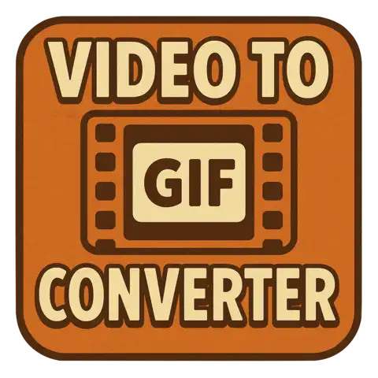
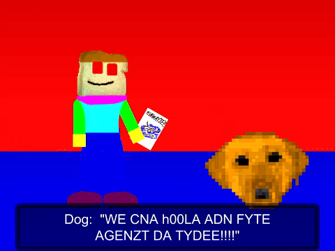

# video2gif, a Video to GIF Converter



A comprehensive bash script that converts video files to optimized GIFs using ffmpeg and gifsicle.

- [video2gif, a Video to GIF Converter](#video2gif-a-video-to-gif-converter)
  - [Features](#features)
  - [Prerequisites](#prerequisites)
  - [Installation via Homebrew (MacOS/Linux (x86\_64) - x86\_64/arm64)](#installation-via-homebrew-macoslinux-x86_64---x86_64arm64)
  - [Download the script](#download-the-script)
  - [Usage](#usage)
    - [Required Arguments](#required-arguments)
    - [Optional Arguments](#optional-arguments)
  - [Examples](#examples)
    - [Basic Usage](#basic-usage)
    - [Aspect Ratio Cropping](#aspect-ratio-cropping)
    - [Different Resolutions](#different-resolutions)
    - [Optimization Settings](#optimization-settings)
  - [How It Works](#how-it-works)
  - [File Size Optimization](#file-size-optimization)
  - [Troubleshooting](#troubleshooting)
  - [Common Use Cases](#common-use-cases)
    - [From Your Original Commands](#from-your-original-commands)

## Features

- ✅ Extract video segments by time range
- ✅ Generate high-quality palettes for better GIF colors
- ✅ Customizable frame rate, resolution, and cropping
- ✅ Automatic aspect ratio handling (4:3, 16:9)
- ✅ GIF optimization with gifsicle
- ✅ Comprehensive error handling and logging
- ✅ Temporary file cleanup

## Prerequisites

Make sure you have the following tools installed:

```bash
# Install ffmpeg
brew install ffmpeg

# Install gifsicle
brew install gifsicle
```

## Installation via Homebrew (MacOS/Linux (x86_64) - x86_64/arm64)

```bash
brew install stenstromen/tap/video2gif
```

## Download the script

- For **MacOS** and **Linux**: Checkout and download the latest binary from [Releases page](https://github.com/Stenstromen/video2gif/releases/latest/)

## Usage

```bash
./video2gif -i INPUT_FILE -o OUTPUT_FILE [OPTIONS]
```

### Required Arguments

- `-i, --input FILE` - Input video file
- `-o, --output FILE` - Output GIF file

### Optional Arguments

- `-s, --start TIME` - Start time (format: HH:MM:SS or seconds, default: 00:00:00)
- `-e, --end TIME` - End time (format: HH:MM:SS or seconds)
- `-d, --duration TIME` - Duration instead of end time (format: HH:MM:SS or seconds)
- `-f, --fps NUM` - Frame rate (default: 10)
- `-w, --width NUM` - Width in pixels (default: 720)
- `-h, --height NUM` - Height in pixels (default: auto-calculated)
- `-c, --crop WxH:X:Y` - Crop video (format: width:height:x:y)
- `-a, --aspect RATIO` - Aspect ratio (4:3, 16:9, etc.)
- `-ol, --opt-level NUM` - Gifsicle optimization level 1-3 (default: 3)
- `-ll, --lossy NUM` - Gifsicle lossy level 1-200 (default: 100)
- `-k, --keep-temp` - Keep temporary files for debugging
- `--help` - Show help message
- `--version` - Show version information

## Examples

### Basic Usage

```bash
# Convert 3 seconds starting from 10:38
./video2gif -i "movie.mkv" -o "output.gif" -s 00:10:38 -e 00:10:41

# Using duration instead of end time
./video2gif -i "movie.mkv" -o "output.gif" -s 30 -d 5

# High quality with custom settings
./video2gif -i "movie.mkv" -o "output.gif" -s 00:10:38 -d 3 -f 15 -w 480
```

### Aspect Ratio Cropping

```bash
# Automatically crop to 4:3 aspect ratio
./video2gif -i "movie.mkv" -o "output.gif" -s 00:10:38 -d 3 -a 4:3

# Custom cropping
./video2gif -i "movie.mkv" -o "output.gif" -s 00:10:38 -d 3 -c 1440:1080:240:0
```

### Different Resolutions

```bash
# 480px wide (360px tall)
./video2gif -i "movie.mkv" -o "output.gif" -s 00:02:18 -e 00:02:20 -c 1440:1080:240:0 -w 480

# 360px wide (270px tall)
./video2gif -i "movie.mkv" -o "output.gif" -s 00:02:18 -e 00:02:20 -c 1440:1080:240:0 -w 360

# 240px wide (180px tall) - very small
./video2gif -i "movie.mkv" -o "output.gif" -s 00:02:18 -e 00:02:20 -c 1440:1080:240:0 -w 240
```

### Optimization Settings

```bash
# Maximum compression
./video2gif -i "movie.mkv" -o "output.gif" -s 00:10:38 -d 3 -ol 3 -ll 200

# Better quality, larger file
./video2gif -i "movie.mkv" -o "output.gif" -s 00:10:38 -d 3 -ol 1 -ll 50
```

## How It Works

1. **Extract Segment**: Uses ffmpeg to extract and re-encode the specified time range from the input video (ensures compatibility with all codecs)
2. **Generate Palette**: Creates a color palette optimized for the video segment
3. **Create GIF**: Uses the palette to generate a high-quality GIF with proper dithering
4. **Optimize**: Uses gifsicle to compress the GIF further with minimal quality loss

## File Size Optimization

The script automatically optimizes GIFs using gifsicle with these default settings:

- Optimization level: 3 (maximum)
- Lossy compression: 100 (moderate quality loss)

You can adjust these settings using the `-ol` and `-ll` options for different quality/size trade-offs.

## Troubleshooting

- If you get "command not found" errors, make sure ffmpeg and gifsicle are installed
- Use `--keep-temp` to debug issues with temporary files
- Check the log output for detailed error messages
- For large files, consider using a lower FPS or smaller resolution
- If you get "Output file is empty" errors, verify that your time range is within the video duration
- HEVC/H.265 videos are fully supported (the script re-encodes segments for better compatibility)

## Common Use Cases

### From Your Original Commands

```bash
# Your original workflow converted to script usage:

# Extract segment (replaces your first command)
./video2gif -i "movie.mkv" -o "output.gif" -s 00:10:38 -e 00:10:41

# With 4:3 aspect ratio cropping (replaces your crop commands)
./video2gif -i "movie.mkv" -o "output.gif" -s 00:10:38 -e 00:10:41 -a 4:3
```

The script handles all the intermediate steps (palette generation, optimization) automatically!


